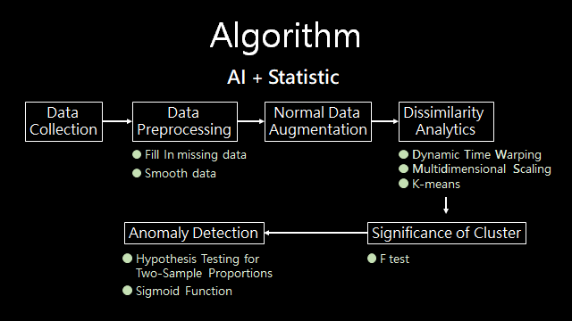
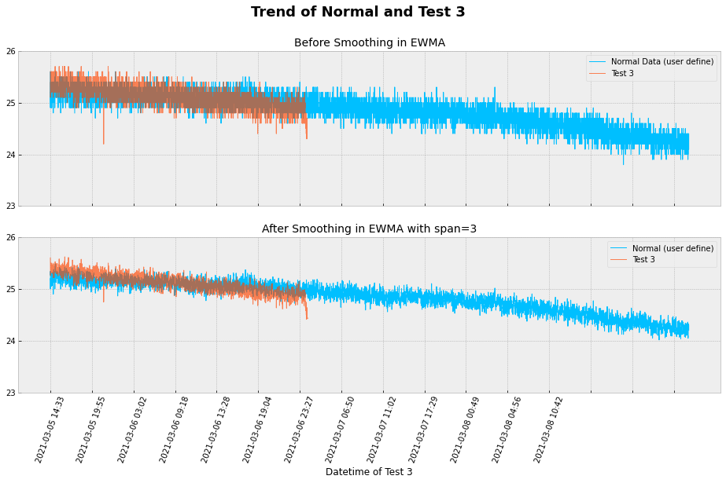
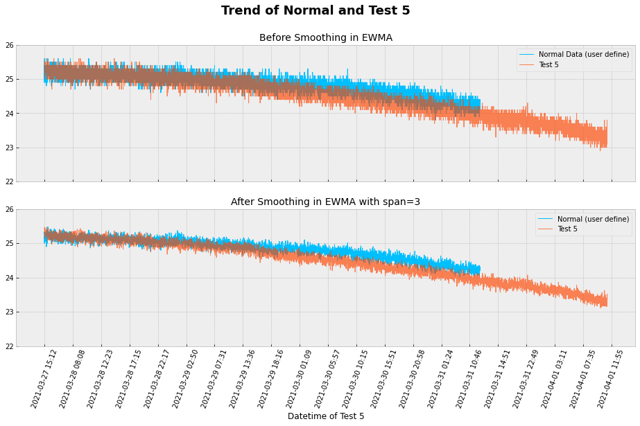

# Trend Detection  
     

## Author  
 - &copy; Tom Wu (<a href="https://github.com/YenLinWu">Github</a>)   

## Objective    
A manufacturing process should be in control to assess the process capability. Nowadays, statistical process control (SPC) charts have been incorporated by organizations around the world as one of the primary tools to monitor and improve the control of a process. The statistical process control (SPC) chart was invented by [Walter A. Shewhart](https://en.wikipedia.org/wiki/Walter_A._Shewhart) working for Bell Labs in the 1920s. The SPC chart is used to study the changes in the process over time by plotting data points, control limits(管制上下界), and a center line(中心線). Note that a process is in statistical control when only common cause variation exist and when the statistical properties do not vary over time.  

   

Image Source : [Wikimedia Commons](https://commons.wikimedia.org/wiki/File:Xbar_chart_for_a_paired_xbar_and_R_chart.svg)  
 
In this work, we will monitor the trend of the data over time for ensuring trends in data are consistent. Becasuse there is a trend in the data over time, we cannot use the SPC chart to objectively assess process capability. Here, we use **Dissimilarity Analytics** to monitor the trend of the data. A dissimilarity analytics is applicable to time-series data and is a very robust technique to compare two or more time-series data.  

## Algorithm  
There are three main machine learning models of our algorithm : **Dynamic Time Warping**, **Multidimensional Scaling** and **K-means**. The overall structure of algorithm is shown in the following figure.
  

[1] Dynamic Time Warping, DTW [ [Studying Note](https://colab.research.google.com/github/YenLinWu/Trend_Detection/blob/main/Dynamic_Time_Warping/Studying_Note.ipynb) ]    
[2] Multidimensional Scaling, MDS [ [Studying Note](https://hackmd.io/@20gd3hLfS7G4xfz9rKqycw/multidimensional_scaling) ][ [Sample Code](https://colab.research.google.com/github/YenLinWu/Trend_Detection/blob/main/Multidimensional_Scaling/Multidimensional_Scaling.ipynb) ]

## Proof Of Concept
* Sample Dataset  
The sample dataset in this work is from a real panel process by Electronic Data Capture(EDC) system. There are 95,419 data of the test item between 1st February 2021 and 19th January 2022, with 11 times parts replacement.  

    

* Normal Pattern    
The overall pattern of the sample dataset is shown in the following figure. First, the normal pattern must be defined. We define the normal pattern by the data from 2021/2/12 01:54 to 2021/2/19 15:17.  

    
  
* Test Data   
Now, we will detect the pattern of each test data (Test 1~7 in the above figure) by comparing each test data and defined normal data.  
  
* Model Performance (offline)  
  From the above figure, we intuitively get the feeling that the trend of the Test 6 and Test 7 are obviously flat. This algorithm confirms our feelings! This model can effectively distinguish differences in trends and the model performance is stable. We can view the detection results of each test data in the following figure and gif.       
    
 

  

 Test 1 Result 

  

    
    
      
  [[View original gif]](./Output_Images_of_POC/Detection_Output_of_Test_1.gif)  

   

  

 Test 2 Result 

  

  
    
        
  [[View original gif]](./Output_Images_of_POC/Detection_Output_of_Test_2.gif)  

   

  

 Test 3 Result 

  

  
    
          
  [[View original gif]](./Output_Images_of_POC/Detection_Output_of_Test_3.gif)  

   

  

 Test 4 Result 

  

  
    
          
  [[View original gif]](./Output_Images_of_POC/Detection_Output_of_Test_4.gif)  

   

  

 Test 5 Result 

  

  
    
          
  [[View original gif]](./Output_Images_of_POC/Detection_Output_of_Test_5.gif)  

   

  

 Test 6 Result 

  

  
    
          
  [[View original gif]](./Output_Images_of_POC/Detection_Output_of_Test_6.gif)  

   

  

 Test 7 Result 

  

    
    
      
  [[View original gif]](./Output_Images_of_POC/Detection_Output_of_Test_7.gif)  

  
 
## References  
**[1]** Similarity Measures and Dimensionality Reduction Techniques for Time Series Data Mining, Carmelo Cassisi, Placido Montalto, Marco Aliotta, Andrea Cannata and Alfredo Pulvirenti, September 2012.  [ [Download Link](https://www.intechopen.com/chapters/39030) ]
    
**[2]** Identification of Out-of-Trend Stability Results, PhRMA CMC Statistics and Stability Expert Teams, April 2003. [ [Download Link](http://alfresco-static-files.s3.amazonaws.com/alfresco_images/pharma/2014/08/22/5d9c565f-81ff-4879-aaed-20acd24d0335/article-52982.pdf) ]    
  
**[3]** Methods for Identifying Out-of-Trend Data in Analysis of Stability Measurements–Part I: Regression Control Chart, Máté Mihalovits and Sándor Kemény, November 2, 2017. [ [Download Link](https://cdn.sanity.io/files/0vv8moc6/pharmtech/e80e5dbb15ba554cd2a9aaa7200c6ef665ffc019.pdf) ] [ [Reading Note](https://colab.research.google.com/github/YenLinWu/Trend_Detection/blob/main/Regression_Control_Chart/Reading_Note.ipynb) ] 
    
**[4]** Methods for Identifying Out-of-Trend Data in Analysis of Stability Measurements—Part II: By-Time-Point and Multivariate Control Chart, Máté Mihalovits and Sándor Kemény, December 2017. [ [Download Link](http://alfresco-static-files.s3.amazonaws.com/alfresco_images/pharma/2017/12/13/fd4d33b3-f2a5-41ec-8f57-a29194945342/PT1217_038-043_PeerReviewed.pdf) ] 
   
**[5]** Learning Confidence for Out-of-Distribution Detection in Neural Networks, Terrance DeVries and Graham W. Taylor, February 2018.  [ [Download Link](https://arxiv.org/pdf/1802.04865.pdf) ]
  

## Further Readings    

> Articles   

**[1]** [Time Series Similarity Using Dynamic Time Warping -Explained](https://medium.com/walmartglobaltech/time-series-similarity-using-dynamic-time-warping-explained-9d09119e48ec), Abhishek Mishra, December 2020.    
**[2]** [Timeseries Classification: KNN & DTW](https://nbviewer.org/github/markdregan/K-Nearest-Neighbors-with-Dynamic-Time-Warping/blob/master/K_Nearest_Neighbor_Dynamic_Time_Warping.ipynb), Mark Regan, October 2018.

> Programming

**[1]** [dtw-python: Dynamic Time Warping in Python](https://dynamictimewarping.github.io/python/)
  
**[2]** [Python Data Science Handbook](https://jakevdp.github.io/PythonDataScienceHandbook/)
  

## Acknowledgement    
Please cite this repository [Trend Detection](https://github.com/YenLinWu/Trend_Detection) if you use it.  
